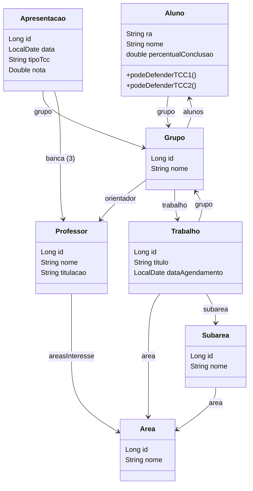

# Diagrama de Classes (Mermaid)



# Diagrama ER (Mermaid)

```mermaid
erDiagram
    ALUNO {
        ra VARCHAR PK
        nome VARCHAR
        percentual_conclusao DOUBLE
        grupo_id FK
    }
    GRUPO {
        id INT PK
        nome VARCHAR
        orientador_id FK
    }
    PROFESSOR {
        id INT PK
        nome VARCHAR
        titulacao VARCHAR
    }
    AREA {
        id INT PK
        nome VARCHAR
    }
    SUBAREA {
        id INT PK
        nome VARCHAR
        area_id FK
    }
    TRABALHO {
        id INT PK
        titulo VARCHAR
        area_id FK
        subarea_id FK
        grupo_id FK
        data_agendamento DATE
    }
    APRESENTACAO {
        id INT PK
        grupo_id FK
        data DATE
        tipo_tcc VARCHAR
        nota DOUBLE
    }
    APRESENTACAO_BANCA {
        apresentacao_id FK
        professor_id FK
    }
    ALUNO ||--o{ GRUPO : pertence
    GRUPO }o--|| PROFESSOR : orientador
    GRUPO ||--o{ ALUNO : possui
    GRUPO ||--|| TRABALHO : realiza
    PROFESSOR }o--o{ AREA : interesse
    TRABALHO }o--|| AREA : pertence
    TRABALHO }o--|| SUBAREA : pertence
    TRABALHO ||--|| GRUPO : de
    APRESENTACAO }o--|| GRUPO : apresenta
    APRESENTACAO }o--o{ APRESENTACAO_BANCA : banca
    APRESENTACAO_BANCA }o--|| PROFESSOR : membro
    SUBAREA }o--|| AREA : pertence
```
